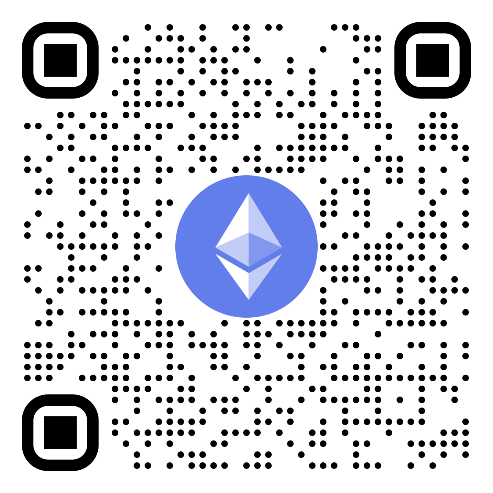

## Other Contributions
- [awslabs/llrt](https://github.com/search?q=author%3Afloydspace+is%3Amerged+repo%3Aawslabs%2Fllrt+&type=pullrequests&ref=advsearch&state=closed)
- [esbuild](https://github.com/search?q=author%3Afloydspace+is%3Amerged+repo%3Aevanw%2Fesbuild&type=pullrequests&ref=advsearch&state=closed)
- [projen](https://github.com/search?q=author%3Afloydspace+is%3Amerged+repo%3Aprojen%2Fprojen&type=pullrequests&ref=advsearch&state=closed)
- [sequelize](https://github.com/search?q=author%3Afloydspace+is%3Amerged+repo%3Asequelize%2Fsequelize&type=pullrequests&ref=advsearch&state=closed)
- [serverless-fargate-plugin](https://github.com/search?q=author%3Afloydspace+is%3Amerged+repo%3Ahonerlaw%2Fserverless-fargate-plugin&type=pullrequests&ref=advsearch&state=closed)
- [serverless-step-functions](https://github.com/search?q=author%3Afloydspace+is%3Amerged+repo%3Aserverless-operations%2Fserverless-step-functions&type=pullrequests&ref=advsearch&state=closed)
- [fly-apps/terraform-provider-fly](https://github.com/search?q=author%3Afloydspace+is%3Amerged+repo%3Afly-apps%2Fterraform-provider-fly&type=pullrequests&ref=advsearch&state=closed)
- [MetaMask/metamask-extension](https://github.com/search?q=author%3Afloydspace+is%3Amerged+repo%3AMetaMask%2Fmetamask-extension&type=pullrequests&ref=advsearch&state=closed)
- [JetBrains/create-react-kotlin-app](https://github.com/search?q=author%3Afloydspace+is%3Amerged+repo%3AJetBrains%2Fcreate-react-kotlin-app&type=pullrequests&ref=advsearch&state=closed)
- [ionic-team/ionic-framework](https://github.com/search?q=author%3Afloydspace+is%3Amerged+repo%3Aionic-team%2Fionic-framework&type=pullrequests&ref=advsearch&state=closed)
- [antvis/G2Plot](https://github.com/search?q=author%3Afloydspace+is%3Amerged+repo%3Aantvis%2FG2Plot&type=pullrequests&ref=advsearch&state=closed)
- [strcase](https://github.com/search?q=author%3Afloydspace+is%3Amerged+repo%3Aiancoleman%2Fstrcase&type=pullrequests&ref=advsearch&state=closed)

## Support
- **BTC**: bc1qnlrp0qu0w5732s2s92682kp6wts45lnu4zj4lm _(SegWit)_
- **ETH**: 0x2264E9c059b358e1E4DE2558c74bf5a46E3F6B9d
- **SOL**: 7PmZZQVGnREtXkDUE3pgNfDbRz8S1zE8SyP6k99JRMC8 _(No Memo)_

  
  
  

<!-- ## Backers
Warm _Thank you!_ to my backer: -->
