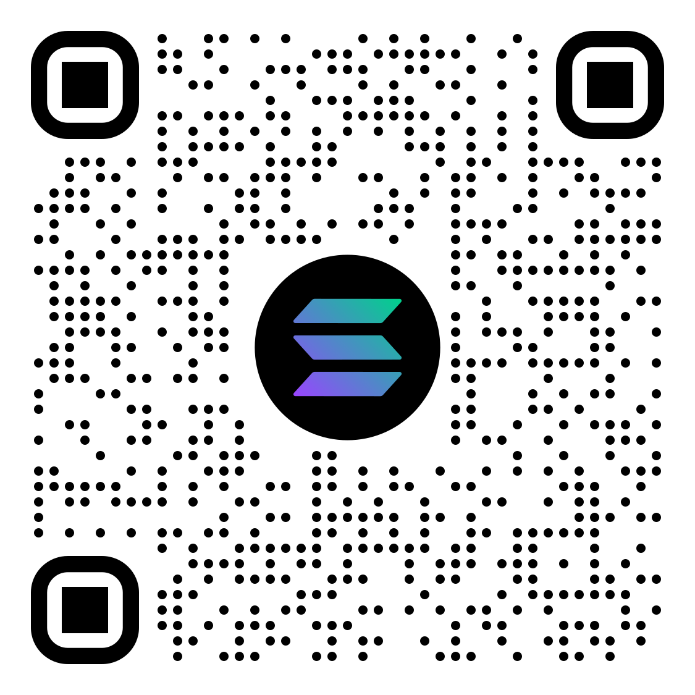

## Support
- **BTC**: bc1qnlrp0qu0w5732s2s92682kp6wts45lnu4zj4lm _(SegWit)_
- **ETH**: 0x2264E9c059b358e1E4DE2558c74bf5a46E3F6B9d
- **SOL**: 7PmZZQVGnREtXkDUE3pgNfDbRz8S1zE8SyP6k99JRMC8 _(No Memo)_

  
  
  

<!-- ## Backers
Warm _Thank you!_ to my backer: -->
